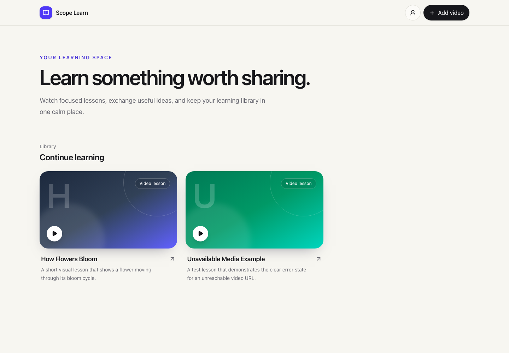
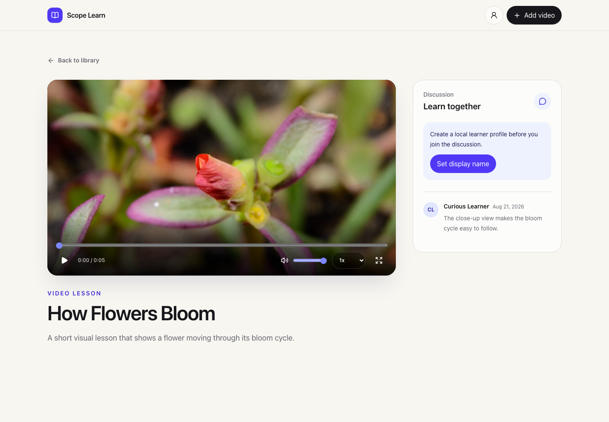
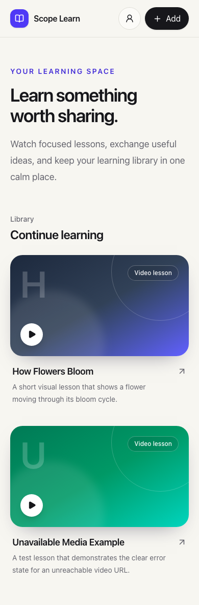

# Scope Learn

Scope Learn is a modern educational video application for the Scope Labs frontend take-home assessment. It gives learners one focused place to add video lessons, watch them with complete playback controls, and discuss them with other users.

## Screenshots

### Video library



### Lesson and discussion



### Mobile library



## Features

- Responsive video library with loading, empty, failure, and retry states.
- Stable lesson URLs at `/watch/:videoId`.
- Video creation with title, description, and URL validation.
- Direct MP4 and WebM playback.
- Play, pause, seek, volume, mute, playback speed, and full-screen controls.
- Player keyboard commands and visible focus states.
- Local learner profile for comment identity.
- Comment loading and creation with clear pending and error states.
- Same-origin API proxy for local development and Vercel hosting.
- Runtime response validation for the supplied API.
- Reduced-motion support and responsive touch targets.

## Technology

- React 19 and TypeScript
- Vite 8 and Bun
- React Router
- TanStack Query
- React Hook Form and Zod
- Tailwind CSS
- Vitest and React Testing Library
- Playwright

## Run Locally

Requirements:

- Bun 1.1 or later

Install dependencies:

```bash
bun install
```

Create the local environment file:

```bash
cp .env.example .env
```

The assessment video-owner ID is already set to `dez_calimese`. Start the app:

```bash
bun run dev
```

Open [http://localhost:5173](http://localhost:5173).

## Production Build

Create and inspect the production build:

```bash
bun run build
bun run preview
```

The built files are written to `dist/`.

## Tests and Checks

Run all fast checks, unit tests, and the production build:

```bash
bun run check
```

Run the Playwright end-to-end tests:

```bash
bunx playwright install chromium
bun run test:e2e
```

Other useful commands:

| Command                | Purpose                       |
| ---------------------- | ----------------------------- |
| `bun run typecheck`    | Check TypeScript types.       |
| `bun run lint`         | Run Oxlint.                   |
| `bun run format:check` | Check formatting.             |
| `bun run test`         | Run unit and component tests. |
| `bun run test:watch`   | Run tests during development. |

## Keyboard Controls

Focus the video player before you use these commands.

| Key                           | Action                     |
| ----------------------------- | -------------------------- |
| `Space` or `K`                | Play or pause.             |
| `M`                           | Mute or unmute.            |
| `F`                           | Enter or exit full screen. |
| `Left Arrow` or `Right Arrow` | Seek by five seconds.      |
| `Up Arrow` or `Down Arrow`    | Change volume.             |

## Architecture

```text
src/
  app/             Router and application providers
  components/      Shared application shell
  features/
    comments/      Comment queries, list, and form
    player/        Video player and controls
    profile/       Local learner identity
    videos/        Library, lesson page, and creation flow
  lib/
    api/           HTTP client, schemas, types, and API methods
    config/        Validated environment configuration
    validation/    Shared form rules
  styles/          Design tokens and global styles
  test/            Test setup
```

TanStack Query owns remote server state. The route owns the selected video. Forms and player controls keep local state. The learner profile uses a small versioned browser-storage record. No global state library is necessary.

The API boundary treats response data as unknown. Zod schemas normalize API fields such as `video_id` and `video_url` into application types. The live service returns `{ "success": "POST /videos" }` for write operations, although its OpenAPI documentation describes a string response. The adapter handles this difference.

## API and Proxy

The app uses the supplied [Scope Labs assessment API](https://take-home-assessment-423502.uc.r.appspot.com/docs).

The API does not return CORS headers. Direct requests from a browser on another origin fail. The app therefore sends requests to its own `/api` path:

- Vite proxies `/api` during local development.
- `vercel.json` applies the same rewrite in production.

The proxy contains no application logic and stores no data.

## Deploy to Vercel

1. Push this repository to GitHub.
2. Import the repository in Vercel.
3. Keep the detected Vite build settings.
4. Set `VITE_USER_ID` to `dez_calimese` if the host does not use `.env.example`.
5. Deploy.

The included rewrite supports API requests and browser refreshes on lesson routes.

## Product Decisions and Limits

### Learner identity

The backend accepts a free-form `user_id` for comments. It has no registration, password, session, or protected-account endpoints. Scope Learn therefore uses a local display-name profile. This profile is identity for comments, not secure authentication.

### Video URL instead of file upload

The supplied API stores a `video_url`; it does not accept files or provide media storage. The creation form therefore provides a clear video URL option. A local file upload would work only until the page closes and would not be available to other users. A real file upload requires object storage, an upload endpoint, file validation, size limits, and access controls.

For reliable playback, use a direct MP4 or WebM URL. YouTube page URLs are not direct media files and require a separate provider adapter.

### Test data

The live assessment account includes:

- `How Flowers Bloom`: a working public MP4 lesson.
- `Unavailable Media Example`: an intentional playback-error example. The source host blocked the media after creation, and the assessment API does not provide a delete operation.
- One comment from the fake user ID `curious_learner`.

## Roadmap

See [ROADMAP.md](./ROADMAP.md) for delivery phases, design details, risks, and scope decisions.
